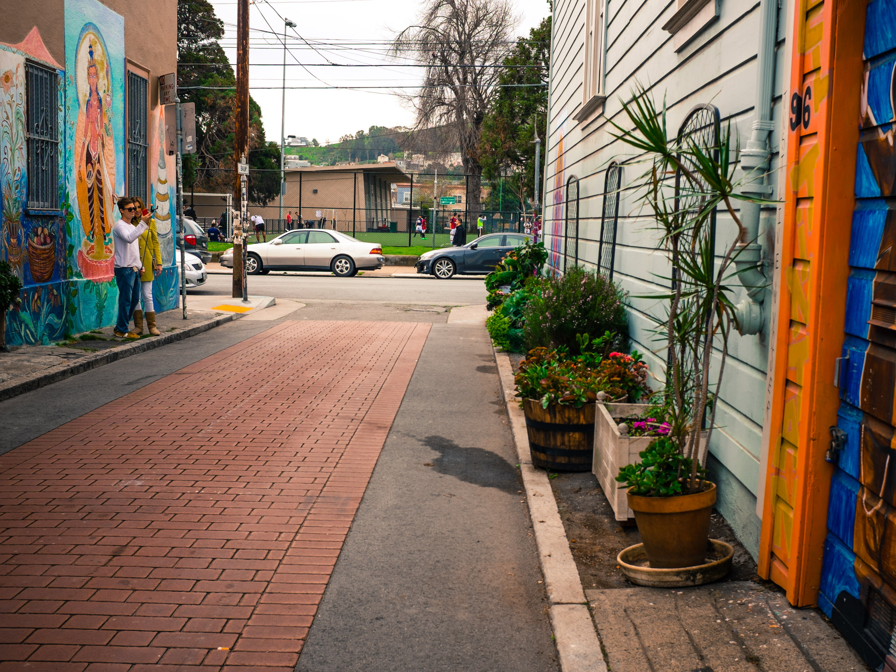
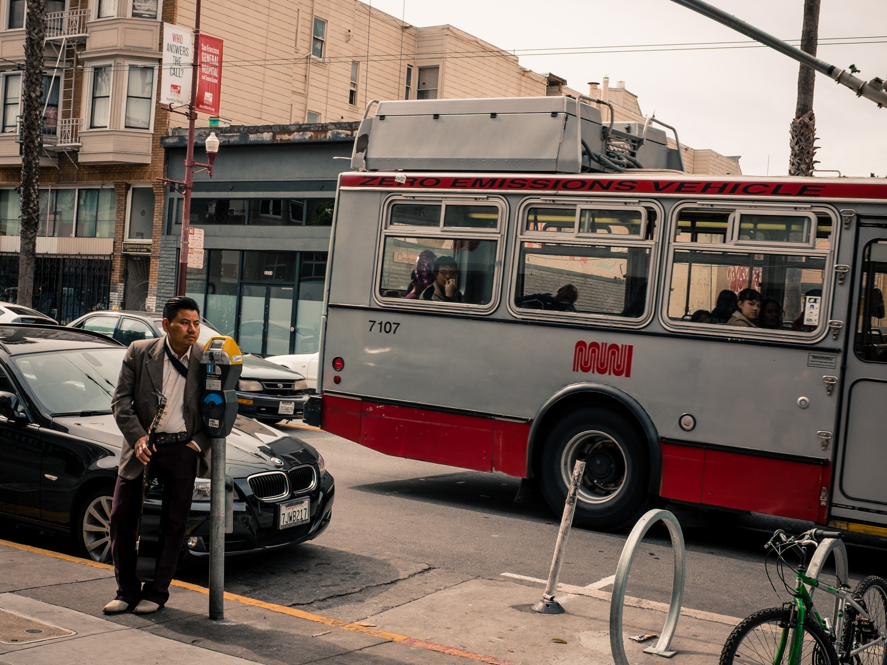
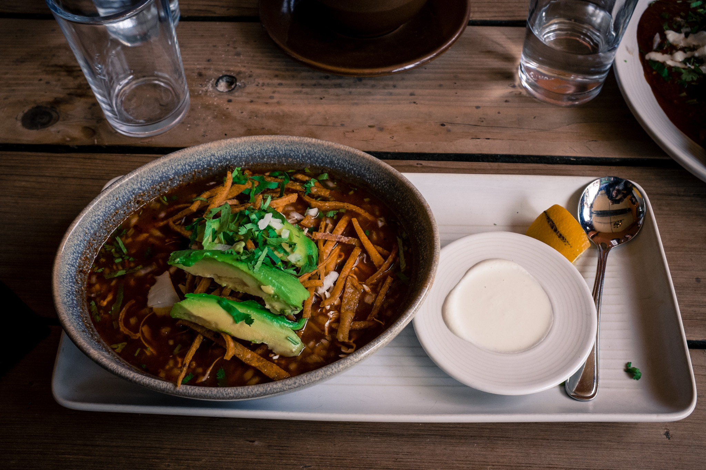

Street photography has always been an activity that I approach with hesitation.
I live in a city where the minutiae to some delights me.
Basically, there is a lot of people watching one can do.

I call the Mission District home and the inhabitants and their lifestyles of
the neighborhood vary from one block to the next.

I've always been a timid photographer, but love to capture others in their day to day.
Being "caught" as one might say by the person being photographed is my biggest fear as it would
change the person's behavior into something less natural, and, to me, less interesting.

Skill-sharing, workshops, photowalks, etc. in San Francisco are abundant and I feel lucky to have
be able to learn from others. I joined [David Coleman](http://www.eventbrite.com/o/david-coleman-photography-7965502924) and a few others on a 3 hour street photography workshop
where I came away with a few tidbits of information that I hope to incorporate into my "practice."

The workshop was balanced between technical and intentional techniques that one can do to aid in venturing out in to the streets. The murals in the Mission District's Balmy Alley was our playground for the morning.

One of the biggest takeaways I got from the session was not technical in nature: capture a streetscape with the intent of composing a narrative with images.

David further instructed us on focusing to capture a "thematic body of work" through a series of images rather than just one perfect shot.
More importantly, the complete narrative is 90% story and technical aspects only really play a part in the 10%. We learned a lot about capturing gestures and how a gesture can create a landscape for a story.

David also gave us a few tips for staying low profile in public.
The most unique of them all was covering the logos and any flashy brand inscriptions on the camera with black electrical tape! Other tips to note were dressing in cool tones and muted colors to call less attention to yourself and reducing the amount of swing needed to bring the viewfinder up to your eyes to take a shot.

On the technical side of things, we were recommended to

* stay within 21mm to 50mm focal range, basically wide angle lens.
* shoot in aperture or manual mode
* begin at a minimum 5.6 F-stop and increase up to F11 as the sun comes out (we had an overcast start to the morning).
* set the shutter speed to 1/250th of a second in order to freeze motion and go up as needed
* use Auto ISO at 200

Another concept I had never heard of was "[zone-focusing](http://inmybag.net/learn-to-zone-focus/)" wherein one gauges the distance between the lens and potential subjects and adjusts focus manually and leave set and ready for someone or something to step into the "kill zone". A good zone is usually optically 1/3 of the way between you and a wall. This is to avoid wasting time allowing the camera auto-focusing given that your depth of field within the space is predictable. This article explains things further.

During the remainder of the session we walked around taking shots and incorporating these things in mind and then reconvened at [Gracias Madre](http://4sq.com/8KFzOk) for vegan Mexican food. The pozole rojo was as delicious and reminiscent of what I would enjoy with my family.

Some other nuggets of knowledge were
* Ask for forgiveness rather than for permission when taking someone's photo. Asking first changes behavior.
* The palm of your hand is 18% reflective and can be substituted for a [grey card in a pinch when estimating exposure](http://petapixel.com/2012/06/06/use-your-hand-as-a-makeshift-gray-card-for-estimating-exposure/).
* Shooting someone's stride is best when their front foot is pointing up as it captures a subject moving forward in motion rather than the strike of their heel.
* Formatting SD cards on the camera just re-writes the index file on the card and doesn't actually format the card at all. It's best to format on your computer using [SD Formatter](https://www.sdcard.org/downloads/formatter_4/).

I am happy to have learned a lot and looking forward to practicing photography on the street no matter where I happen to be.
