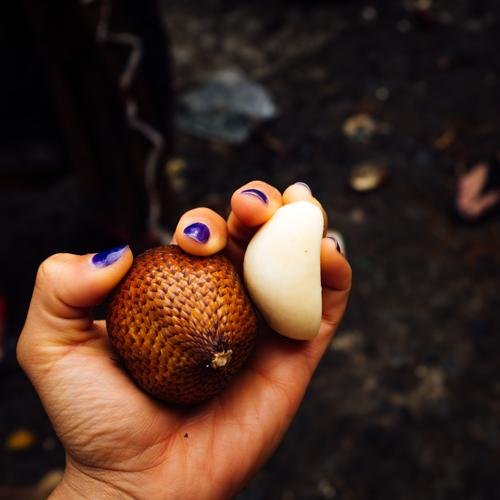
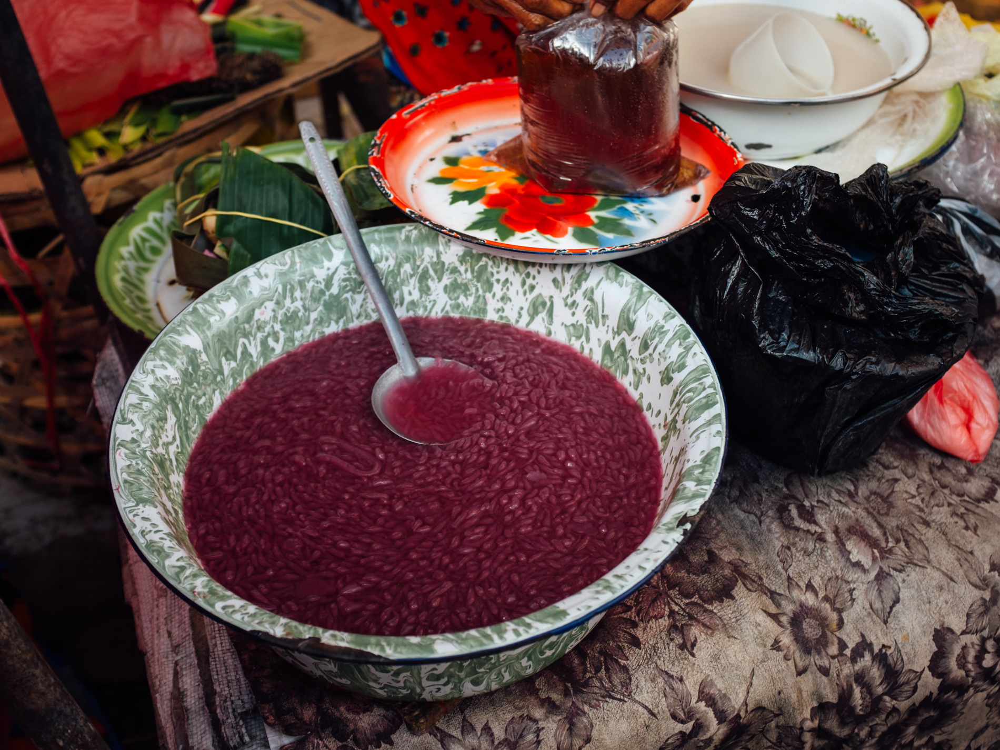
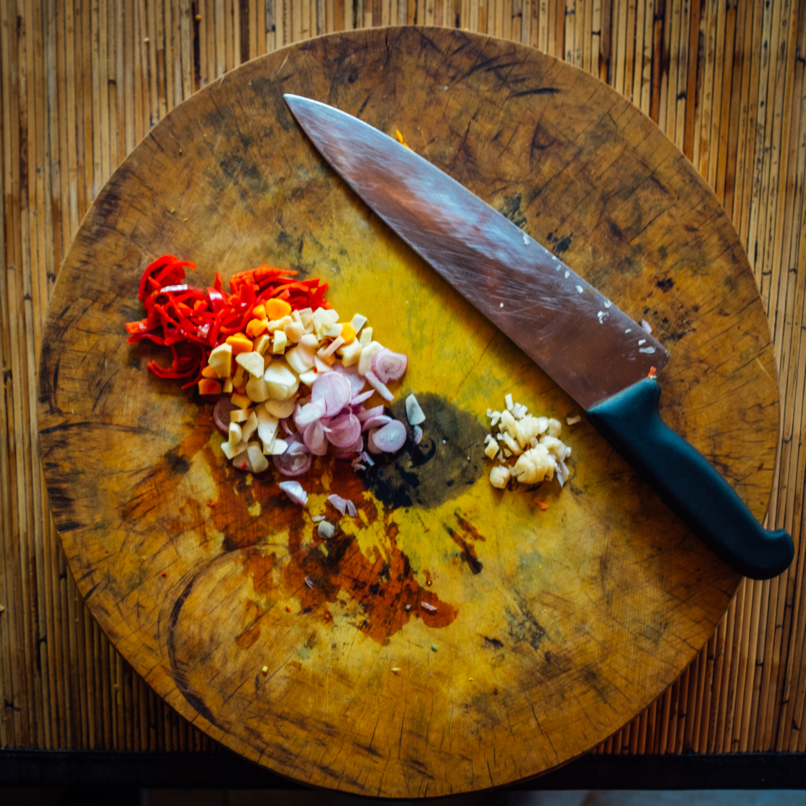
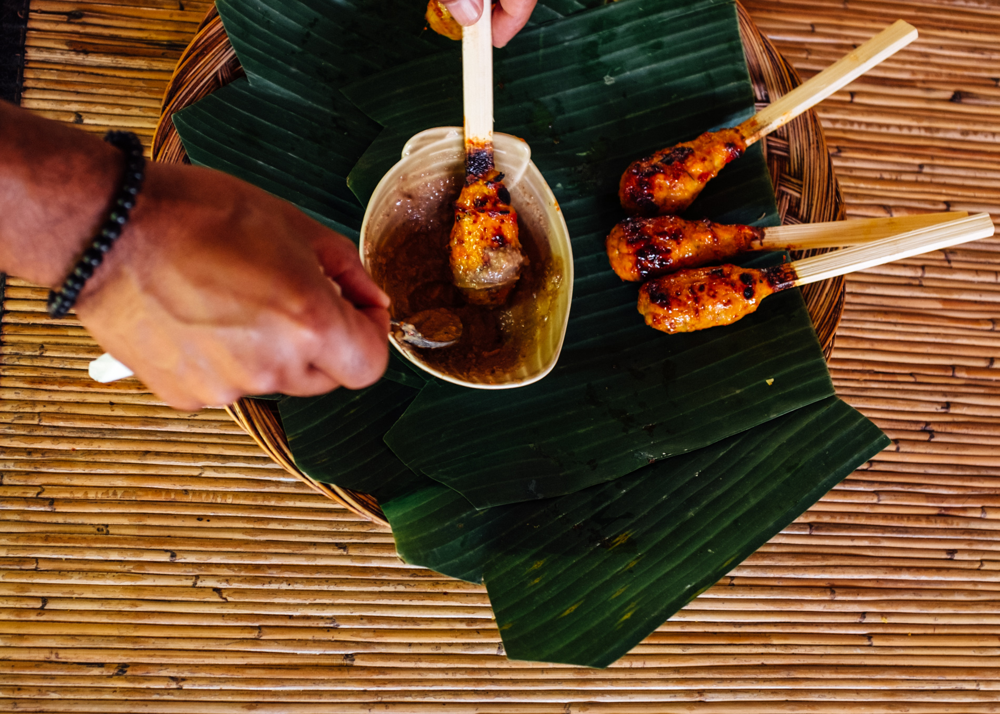
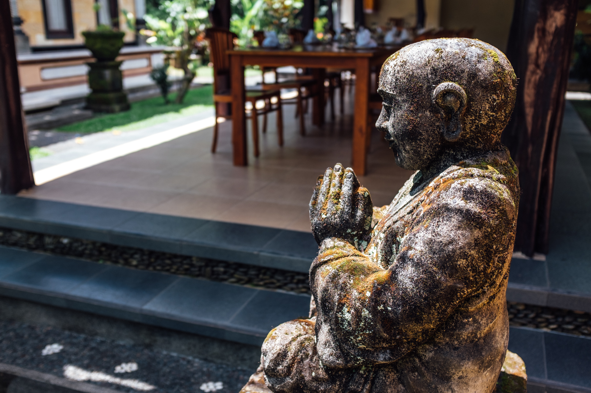

When it comes to traveling, experiencing a new culture through its food is a given. During my search for things to do (i.e. eat) in Bali, I latched on to the description for a cooking class teaching traditional cuisine.

> Begin your experience at a local market, where your Family Host will purchase and explain the fresh herbs, spices, fruits and vegetables used in your class. Once home, you’ll be greeted by Dewa with a pipping hot cup of coffee or tea and his famous Pisang Goreng, fresh made crispy Banana Fritters, to set off your taste buds. You’ll learn how to prepare a complete menu inclusive of appetizer, a variety of traditional mouth-watering entrees, accompanying dishes, and dessert.

 Apart from watching two friends get married, [_The Lobong Culinary Experience_](https://lobongbalicooking.com/lobong-culinary-experience/) became a big highlight of the plans I made for myself leading up to the trip. After the experience I had in Bali and an [experience back home](/cooking-with-cocco/), cooking courses while be at the top of my search criteria when I travel rather than "_where to have the best \<insert regional dish here\>_".

## Payangan Morning Market

The morning of the class, I was whisked away in a van from my home stay in Ubud with the rest of the students and taken a short drive away to the region of Payangan. We would get a first-hand look at an open-air market here without the touristy traffic dominating the market found in Ubud's center. Our 9 am arrival was during the market's lull given that it normally starts at 2 am and over by 10 am. As the saying goes, the early bird gets the worm.

~[Nap time: markets open at 2am and are over by 10](market_markets_open_at_2am_and_close_at_10am.jpg)

Our tour of the market was simply educational, meaning we didn't actually buy anything.
We stopped at a few stands with Sang Made, our market guide, and listened as he pointed out ingredients and produce of interest.

### Breaking the Fast

~[Breakfast of Balinese Champions](market_roast_pig_brekkie.jpg)

One of the more memorable moments was at the beginning of our tour when we looked over at a stand with a full _Babi Guling_ (roast suckling pig) laid out ready for consumption. According to our Sang Made, _Babi Guling_ is Bali's breakfast of champions. The group consisting of 9 Dutch, a couple from France, and me was stunned. Fruit bowls and eggs seemed to be what was being served in the hotels and home stays! Sang Made clarified that yes, that is what is served to foreigners — not what is actually consumed in a Balinese home.

Sang Made explained that in their culture, fruits were normally used for enhancing the offerings to their gods. Fruits are fun, and we inspected many that were exotic for most of us.

~[Familiar fruits](market_familiar_fruits.jpg)
~[Pop quiz, what fruit could this be? The answer is jackfruit!](market_who_can_tell_me_what_fruit.jpg)

We inspected the 'snakeskin' fruit in detail. In summary, it's kinda bland and crunchy. I'll stick to dragon fruit next time.

~[Lives up to its snakeskin name](market_snakeskin_fruit.jpg)
~[Peels like a banana](market_peel_it_like_a_banana.jpg)

## Balinese Culture
During the course of the day, I learned about many facets of Balinese customs and rituals. Most of them related to different stepping stones to reach adulthood.

On our arrival to the Lobong family compound, conversation focused on marriage and the custom for families to ceremoniously come to an agreement about the event.

Families stick together and there’s no such thing as ‘flying the nest’. A male’s residence in his family's compound changes location during the course of his maturity to indicate the change in hierarchy. This change in hierarchy is among many intricate rules and considerations that make a [Balinese traditional home](https://en.wikipedia.org/wiki/Balinese_traditional_house). The close-knit families make it very rare to see homeless in Bali. Family compounds are forever. You will never see a family compound up for sale.

Learning more about the [annual kite festival in Bali](https://en.wikipedia.org/wiki/Bali_Kite_Festival) was inspirational to me. The driver that picked me up from my home stay explained that it is a rooted tradition that has many representations that have changed over time. In a few ways, it represents freedom and coming of age or a symbol of maturity. Bali’s youth took to the rice fields during dusk each day in the time I was there to practice kite flying.

Apparently, [having teeth filed is a common coming of age tradition](http://www.stufftoblowyourmind.com/blogs/higher-human-forms-balinese-tooth-filing.htm), and it made my hair rise.

While we learned a little bit about [daily Hindu offerings](http://alittleadrift.com/ritual-balinese-beliefs-offerings/) during the tour of Payangan market, we learned that the men in a Balinese family play the primary role in the kitchen. While it's stereotypical for women to have the kitchen role in other cultures, in Bali, it's their responsibility to hand-make daily offerings (but in some cases the task is translated to purchasing them at the market).

~[Preparing kits for daily offerings](market_methodical_offering_kit.jpg)

~[Offering vendor waiting for the next customer](market_offering_vendor.jpg)

This is partly because offerings symbolize beauty (it was also mentioned that you will not see men making offerings in Bali, and if you do, that man is referred to as a “beautiful man”).

## Familiarizing Ourselves with Ingredients at the Market

The primary purpose of the market tour was too have a first hand look at what ingredients would look like among market stands.
We talked about the salad we would be making and a distinction was made between the greens in traditional western salads and Balinese salads. In Bali, fern tips are used rather than the common romaine, spinach, and kale.

~[Fresh ferns for Jukut Urab.](market_fern.jpg)
~[Aromatic basil and lemongrass found in a variety of Balinese delicacies](market_aromatic_basil_and_lemongrass.jpg)

 [_Bumbu Bali_ or _Base Gede_ is a sauce that flavors many dishes](https://andanyways.com/2014/05/25/how-to-make-bumbu-bali-or-base-gede/). To me it sounds like a _masala_ you would make to flavor an Indian dish. We inspected each of the root vegetables serving a role in "bumbu Bali" (base Balinese sauce) and discussed the
 difficulty of being able to find these in a conventional grocery store back home.

~[Ginger, galangal, and aromatic ginger](market_root_veggies_used_as_foundation_spices.jpg)

### Market Snacks
During our tour of the market, Sang Made pointed out snack food common in most markets.

We watched a sate stand owner carefully turn each stick of meat and waft air on the coconut shell charcoal to disperse heat.
~[The art of sate means knowing when it's well done.](market_art_of_sate.jpg)
~[Sate stand](market_sate_offerings_at_9am.jpg)

As we watched a woman make what looked like a refreshing coconut jelly drink, Sang Made advised us that our stomachs may not be prepared for it, and that we should stay away.
~[Coconut jelly drink](market_coconut_jelly_snack_drink.jpg)
~[A hefty helping of palm sugar syrup](market_healthy_helping_of_palm_sugar.jpg)

## Chop Chop, Bali!

Our hosts repetitively mentioned we would soon get to go back to the family compound to get down to "chop chop!" This phrase stuck with me and we definitely did a lot of worthwhile chopping. After we licked our plates clean of our day's work, we received a booklet with all of the recipes we'd prepared for the day.

The grunt of the work in two of our dishes was preparing the _bumbu/base gede_ to flavor the meat. The most involved component of preparation for the day!

The preparation of the chicken for the first two chicken recipes was similar with the exception of allowing the first to poach in the sauce and finishing the second on a charcoal grill.

**All recipes, with the exception of _base gede_, _base sate_, and _jamu kunyit_ make 2 servings.**

### Base Gede
_Basic spice base_. A foundation to Balinese cooking!
~[Chop, chop!](prep_chop_bumbu.jpg)

~[Loved some knife work and especially loved the tamarind wood chopping block](prep_mince_bumbu.jpg)
~[Take the bumbu to a mortar and pestle and grind until it forms a paste](prep_collecting_students_bumbu.jpg)

**Ingredients**
- 300 g large red chili, halved, seeded
- 200 g shallots
- 100 g garlic
- 150 g galangal
- 75 g ginger
- 50 g [kencur](http://indonesianfoodculinary.blogspot.com/2009/06/lesser-galingale.html) (lesser galangal) washed
- 175 g fresh turmeric *
- 75 g candle nut *
- 2 tsp coriander seed
- 150 ml coconut oil
- 250 ml water or chicken stock
- 1 tsp black peppercorn
- 2 pieces of lemongrass
- 2 pieces of salam/bay leaves
- 3 pieces of kaffir leaves
- 2 tsp tamarind juice
- 3 tsp palm sugar syrup
- Salt and pepper to taste

\* **Substitutions:**
- Fresh turmeric: turmeric powder
- Candle nut: macadamia nut

**Method**

1. Slice all ingredients except lemongrass, kaffir lime and bay leaves. Chop all until fine.
2. Grind chopped spices in a mortar in pestle or a food processor until a paste is formed.
3. Place paste in a heavy pan and add remaining spices (with the exception of syrup and tamarind). Simmer over medium heat for approximately 20 minutes or until water/chicken stock is incorporated and mixture turns into a golden color.
4. Finally add 3 tsp palm sugar and 2 tsp tamarind juice.
5. Allow to cool thoroughly before use or storage. Freeze to keep for 6 months or less. *

\* **If storing, remove salam leaf, lemongrass, and kaffir lime.**

### Ayam Bakar Sambal Matah
_Shredded poached chicken, lemongrass, chili kaffir lime dressing_

**Ingredients**

- 200 g chicken breast or leg
- 100 g bumbu bali/basic sauce/base gede
- 2 shallots
- 1 chilies
- 1 piece red banana chili
- 1 lemongrass
- 2 torch ginger
- 4 tbsp coconut oil
- a squeeze of lime juice
- salt to taste

**Method**

1. Thinly slice the shallots, chilies, and torch ginger.
2. Meanwhile, sauteé sauce until aromatic and add the chicken. Stir chicken until the well coated.
3. Cook for another minute and add chicken or vegetable stock to poach for an additional 15 minutes.
3. Shred cooked chicken
4. Using a separate bowl, make the raw sambal beginning with kaffir lime juice and coconut and shaking until well combined. Add the sliced ingredients and toss gently until well incorporated.
5. Add the shredded chicken to the final raw sambal (sambal matah).

~[Presentation is key](eat_constructed_ayam_bakar_sambal_matah.jpg)
~[Portioned and plated](eat_final_ayam_bakar_sambal_matah.jpg)

### Ayam Bakar Bumbu Bali (main course)
_Grilled chicken breast, Balinese spice_

~[Sear skin-side down for two minutes](prep_searing_ayam_bakar_bumbu_chicken_two_mins.jpg)
~[Simmer](prep_braising_ayam_bakar_bumbu_chicken.jpg)
~[Grilled and reheating prior to serving](prep_cooked_ayam_bakar_bumbu.jpg)

**Ingredients**

- 2 chicken breasts, skin on
- 1/2 cup base gede
- 2 lemongrass stalks
- 2 salam/bay leaves
- 1 Kaffir lime leaf
- 500 ml coconut milk
- Salt and pepper to taste
- 1 tsp coconut oil

**Method**

1. Heat the oil in a heavy pan and add base gede paste. Sauteé for 5 minutes until the spices are aromatic. Add lemongrass, bay and kaffir lime leaves.
2. To avoid burning the paste, add a bit of chicken or vegetable stock and bring to a boil.
3. Simmer stock for another 5 minutes and add chicken breast skin side down for two minutes.
4. Flip chicken to coat well with base sauce.
5. Add coconut milk and simmer for an additional 5 minutes.
6. Remove chicken from pan and grill until well cooked.
7. Place chicken back in sauce and serve with rice and vegetables.

~[Chicken prior to plating](eat_presented_ayam_bakar_bumbu.jpg)
~[Dig in](eat_overhead_ayam_bakar_bumbu_bali.jpg)

### Jukut Urab
_Mixed vegetable salad, grated coconut, garlic chili dressing._

~
~
~[Grated coconut is a magical secret ingredient](prep_grated_coconut_in_all_the_things.jpg)

**Ingredients**
- 200 g shredded blanched spinach
- 200 g bean sprouts
- 100 g fern tips cut into 1/2 cm slices *
- 1/2 cup roasted grated coconut
- 1 cup sambal goreng
- 1 shredded kaffir lime
- 1 kaffir lime leaf

\* **Substitutions:**
- Fern tips: English spinach, Chinese bok choy

**Method**
1. Combine all blanched green vegetables (fern tips and spinach) and bean sprouts in a bowl.
2. Combine fried shallot, garlic, chili, and roasted grated coconut in a separate bowl and add sambal goreng.
3. Mix all together and gently toss with kaffir lime and lime juice.

**Sambal goreng** (fried sambal, to accompany salad)
- 6 garlic cloves, peeled
- 6-8 shallots, peeled
- 2 red banana chilies, seeded

~[Salad and sambal incorporated](eat_salad_and_sambal.jpg)

**Method**
1. Slice shallot, garlic, and red banana chili and keep separately.
2. Heat coconut oil and fry shallots for 10 seconds before adding garlic.
3. Wait for a few minutes until shallot and garlic have browned. Add chili and keep stirring for another 1 minute or until all spices have browned.
4. Dry out sambal from oil and sprinkle with salt and shredded kaffir lime leaf.

~[Drying out sambal](eat_jukut_urab.jpg)

### Base Sate
_Peanut sauce_

~[Sate paste ingredients](prep_sate_paste_ingredients.jpg)
~[Frying ingredients for sate paste](prep_frying_peanuts_for_sate_paste.jpg)
~[Fry until the garlic is browned and add green chilies at the end](prep_fry_until_garlic_browns.jpg)
~[Forming a paste on a mortar and pestle](prep_stone_ground_paste.jpg)
~[Once a paste is formed, add coconut milk to create the sauce](prep_sate_paste_coconut_milk_for_sauce.jpg)

**Ingredients**
- 250 g raw peanuts with skin
- 5 garlic cloves peeled and sliced
- 1-2 [Thai/bird's eye chilies](https://www.thespruce.com/thai-bird-eye-chili-facts-and-substitutions-3217054) sliced
- 25 g [kencur](http://indonesianfoodculinary.blogspot.com/2009/06/lesser-galingale.html) (lesser galangal) washed and sliced
- 3 tbsp pal sugar syrup
- 50 ml fresh coconut milk
- 2 kaffir lime leaves
- 1 tsp kaffir lime juice
- 2 pieces of shallots
- 1 pinch salt

**Method**
1. Combine peanuts, garlic, chilies, and kencur in a heavy pan with oil and fry until golden brown.
2. Finely grind in a mortar and pestle until a paste forms.
3. Place back into a heavy pan with stock (vegetable or chicken) and stir until smooth. Add kaffir lime leaf and continue to stir until sauce thickens.
4. Add coconut milk and simmer uncovered. Stir to prevent sauce from sticking for 10 minutes.
5. Add the lime juice and palm sugar syrup.
6. Sprinkle with fried shallots before serving.

### Sate Lilit Ayam
_Minced chicken skewers, grated coconut, kaffir lime juice_
~[Ground chicken ready for seasoning](prep_ground_chicken.jpg)
~[Can't forget the grated coconut](prep_grated_coconut_magical_ingredient.jpg)
~[Mix the chicken dough!](prep_mix_the_chicken_dough.jpg)
~[Coax the meat onto its stick](prep_coax_the_meat_on_the_stick.jpg)
~[Ready to grill](prep_basket_of_sate_lilit_ayam.jpg)

**Ingredients**

- 100 g minced/ground chicken leg
- 150 g minced/ground chicken breast
- 2 cups freshly grated coconut
- 1/2 cup base gede
- 5 shredded fragrant lime leaves
- 2 tsp palm sugar syrup
- 1 tsp tamarind juice
- salt to taste

**Method**

1. Combine minced chicken in a bowl and add other ingredients. Mix well.
2. Mold a heaped tablespoon of chicken mixture around a trimmed lemongrass stalk or a wooden skewer.
3. Grill until golden brown.
4. Serve with peanut sauce.

### Sambal Ulek
_Tomato and chili sambal_. Served as a sauce to flavor rice.

~[Mise en place](prep_sambal_ulek_mise_en_place.jpg)
**Ingredients**
- 10 shallots, peeled and sliced
- 5 garlic cloves, peeled and sliced
- 3 large red chilies
- 2 medium Roma tomatoes cut into wedges
- 2 tsp freshly squeeze kaffir lime leaf
- Coconut oil
- Salt to taste

**Method**
1. Heat the oil in a heavy sauce pan or wok. Add shallots and garlic and sauteé for 5 minutes over low heat.
2. Add chilies and sauteé for another 5 minutes.
3. Add tomatoes and simmer for another 10 minutes.
3. Add kaffir lime juice and grind all ingredients into a mortar and pestle. Alternatively, use a food processor to blend the sauce.
4. Season with salt to taste and allow to cool before serving.

### Nasi Sela
_Sweet potato rice_

I didn't photograph the preparation of this dish given that making it took place in a dimly lit kitchen with a stove heated with wood. The process of making Nasi Sela, or steamed rice with sweet potato, takes at least an hour and twenty minutes. This steaming process allows each grain to cook to a point in which it will not stick to any other grain. This dish is the first to be prepared in a Balinese home given the amount of time it takes. While the rice cooks, other dishes can be prepared.

**Ingredients**

- 200 g rice, washed twice
- 100 g cubed sweet potato/butternut pumpkin

**Method**

1. Clean the rice then soak in water for about 20 minutes
2. Steam the rice until half cooked (al dente), approximately 30 minutes.
3. Soak again in hot water for around 15 minutes or until the rice absorbs all the water.
4. Finally, mix the rice with cubed sweet potato and steam again for 30 minutes.
5. To serve, sprinkle fried shallots for additional flavor.

Easy right?

### Bubur Injin (dessert)

_Black rice porridge with coconut milk and palm sugar._

~[Served in a banana leaf](eat_bubur_injin_dessert.jpg)

**Ingredients**

- 200 g black glutinous rice, washed
- 120 ml palm sugar syrup
- 2 pandan leaves, shredded, or 2 drops pandan or vanilla essence.
- 250 ml coconut milk
- Pinch salt
- Fresh coconut to garnish

**Method**

1. Soak the glutinous rice in water overnight.
2. Drain the rice and place in a saucepan with 1.5 liters of water. Heat the mixture until boiling and continue to cook for 20-25 minutes, or until the rice is tender.
3. Stir the sugar and one of the pandan leaves into the rice and continue to cook for 5-7 minutes. Set aside to cool.
4. Meanwhile, heat the coconut milk, remaining pandan leaf and the salt in a saucepan until the mixture thickens.
5. To serve, remove the pandan leaves from the rice into 2 serving bowls. Pour over the coconut milk and garnish with fresh coconut.

### Jamu Kunyit

~[Mid-morning refresher](eat_turmeric_jamu_refreshing_drink.jpg)

**Ingredients**
- 100 g tamarind paste (smashed)
- 150 g turmeric
- 100 g palm sugar syrup
- 1 lime wedge
- 500 ml water

**Method**
1. Mix all ingredients except lime and simmer for 20 minutes
2. Sit aside and let cool. Run through a fine sieve.
3. Serve with ice and lime wedge as garnish.

### Pisang Goreng
_Fried banana fritters_

~[Morning snack](eat_pisang_goreng.jpg)

**Ingredients**
- 6 bananas, halved lengthwise and horizontally.
- 1 cup all purpose flour
- 1/4 cup coconut milk (cream)
- 1 cup dried and shredded unsweetened coconut
- 1/4 cup white sugar
- 1 cup water
- 1/2 tsp salt

**Method**
1. In a large bowl, mix dry ingredients (flour, white sugar, salt).
2. Make a well in the center of the incorporated dry ingredients and pour in milk and water. Mix until smooth.
3. Fold in banana slices until evenly coated.
4. Heat oil in a wok or deep fryer to 375ºF (190ºC).
5. Drop banana mixture by tablespoon into hot oil and fry until golden brown and crispy on the outside (about 10-15 minutes).
6. Remove banana from oil and drain on paper towels. Serve hot with palm sugar syrup.

### Daily Rituals

Before we ate, we followed tradition to honor Hindu gods with offerings from the food we prepared that morning. Sang Made's mother did the honors. Usually, these honors are done early in the morning after the day's food has been prepared and is set aside in the kitchen for whoever is hungry to come and go as they see fit. Balinese rarely eat sitting down together, according to Sang Made.

~[Offerings from our creations](eat_offerings_from_our_creations.jpg)
~[Entering the family temple](eat_enter_the_temple.jpg)
~[Placing the offerings on the shrine](eat_placing_offerings.jpg)
~[Blessing the offerings](eat_blessing_offerings.jpg)

